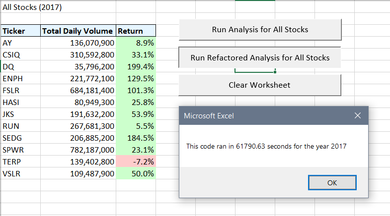
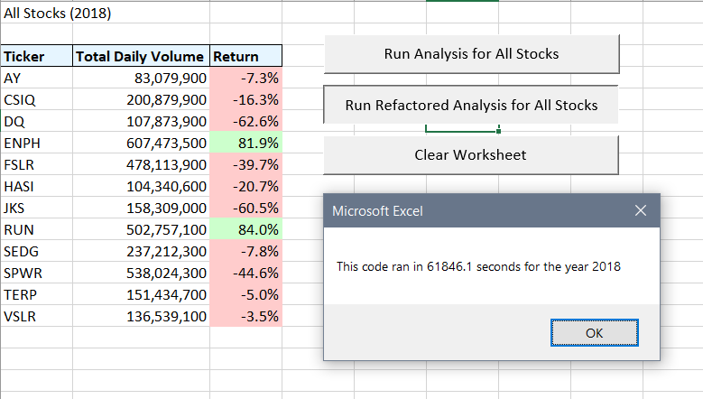

# **Stock Performance Analysis**
##### An analysis of stock market values in 2017 and 2018

### **Purpose of the Analysis**
###### This project expands the stock performance dataset to include the entire stock market over the last few years (2017 and 2018). The workbook that was previously prepared for Steve was effective in analyzing the stock market dataset per year, but it was not adequate in analyzing the complete dataset. Considering this challenge, the original script was refactored to increase efficiency when analyzing thousands of stocks.

#### **Results**
###### Comparatively, the stock performance analysis proves that the named tickers were more successful in the 2017 stock market over the 2018 market. By the numbers, only one ticker displayed a negative market value in 2017, whereas only two tickers displayed a positive market value in 2018.

###### Figure 1

###### Figure 1.1

###### As seen in the above figures, the refactored analysis code ran in 61790.63 seconds and 61846.1 seconds for the years 2017 and 2018, respectively. In comparison, the original script ran in 0.6171875 seconds and 0.609375 seconds for the years 2017 and 2018, respectively (Figures 2 and 2.1). The execution times of the refactored code is evidently much more expedient than the original code, which draws the conclusion that the refactored code more efficient.

###### Figure 2

###### Figure 2.1

#### **Summary**
###### An advantage of refactoring code is that it allows the code to be executed much more efficiently. That said, a disadvantage of running a refactored analysis is that the process is a bit time consuming and it can sometimes be confusing. I, for one, had much more trouble figuring out the correct refactored script than the original script. In addition, I find that the original script is a bit easier to understand than the refactored analysis.
